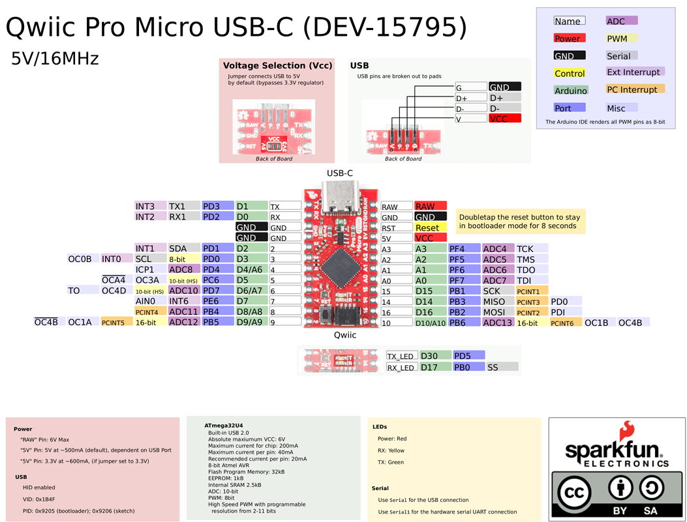
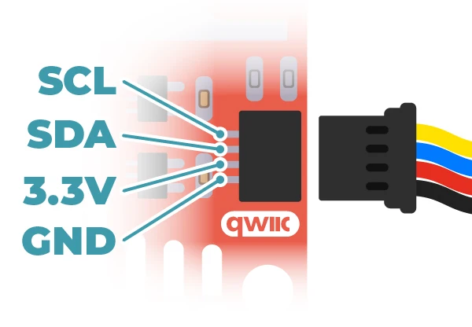

# Sparkfun Pro Micro 5V

## Pin Assignment Table

### External ADC

| Function / Signal                           | ADS 1015 | Type   |
|---------------------------------------------|----------|--------|
| Elevator Axis                               | A0       | Analog |
| Aileron Axis                                | A1       | Analog |
| Rudder Axis                                 | A2       | Analog |
| Throttle                                    | A3       | Analog |
| Ground (All on same Terminal)               | GND      | Power  |
| 3.3V (All on same Terminal)                 | VCC      | Power  |

### Sparkfun Pro Micro

| Function / Signal        | Pro Micro Pin | Type   |
|--------------------------|---------------|--------|
| Brake Encoder CLK        | 0             | Input  |
| Brake Encoder DT         | 1             | Input  |
| Joystick Button          | 4             | Input  |
| Joystick LED             | 5             | Output |
| Release Button           | 8             | Input  |
| Brake Button             | 9             | Input  |
| ADS1015 (I²C SDA)        | SDA (2)       | I²C    |
| ADS1015 (I²C SCL)        | SCL (3)       | I²C    |

## Hall Effect Sensors
The hall effect sensors on this build are 3.3V and designed to be used with the ADS1015 and take power from the 3.3V QWIIC bus.

